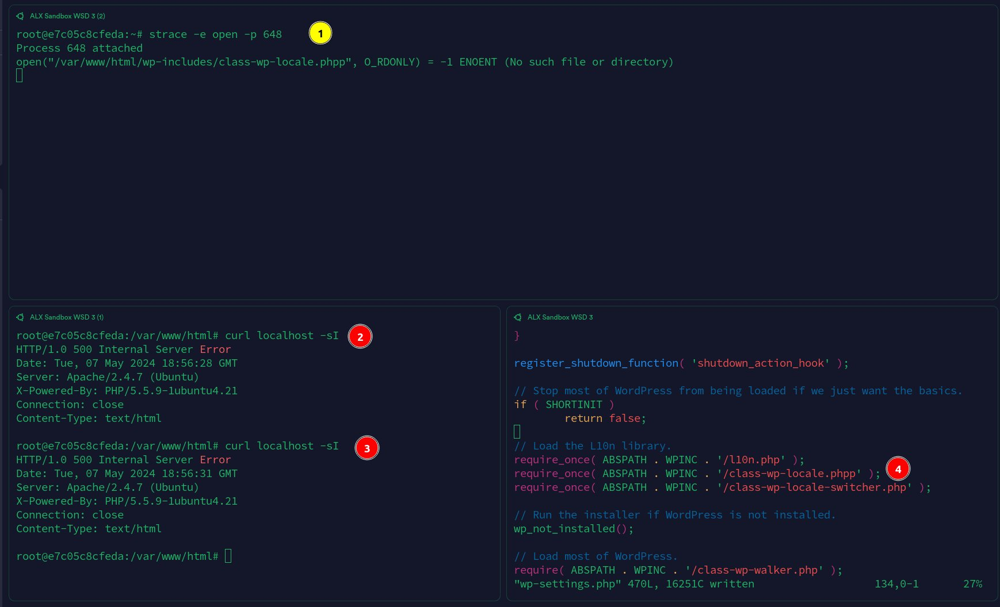
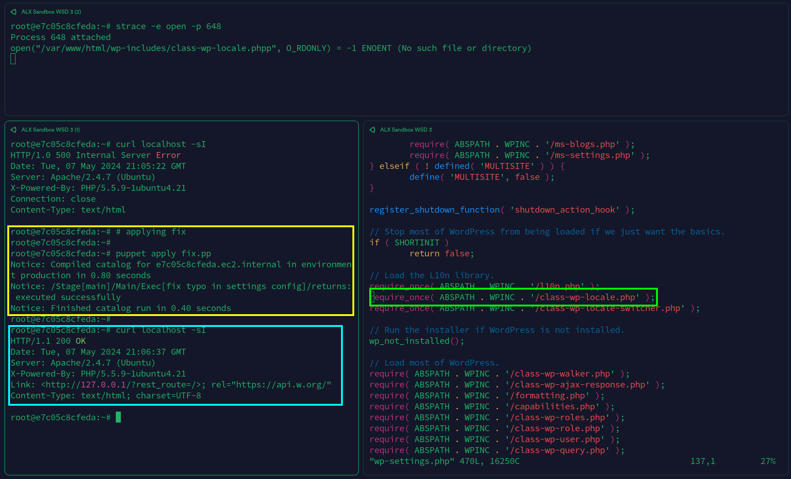

# Web stack debugging - Part 3

## Background Context

This is the third part of a project in which we are given a broken/bugged
webstack and we are tasked with fixing it. This project is meant to help us
learn how to debug and troubleshoot issues with web infrastructure.

The problem with this webstack is that the Apache server is returning error
code 500 (Internal Server Error) when trying to access the website. We are
tasked with fixing this issue.

## Findings

After some investigation using `strace`, I found that the issue was with a
configuration file for the Apache server.



The misconfiguration was in the file `/var/www/html/wp-settings.php`. The
issue was that the file was trying to include another file that did not exist.
The file that was missing was `wp-config.phpp`, but the file that needed to be
included was `wp-config.php`. This was causing the server to return error
code 500.

This is the line that was causing the issue:

```php
// Load the L10n library.
...
require_once( ABSPATH . WPINC . '/class-wp-locale-switcher.phpp' );
```

## Solution

To fix the issue, I simply had to change the file name in the `require_once`
statement from `class-wp-locale-switcher.phpp` to
`class-wp-locale-switcher.php`.

After making this change, the server was able to start and the website was
accessible again.



## Author

- **Maxwell Nana Forson**

### Socials

- [Github](https://github.com/nanafox)
- [Twitter](https://twitter.com/_nanafox)
- [LinkedIn](https://www.linkedin.com/in/maxwellnanaforson/)
